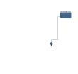
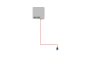
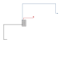
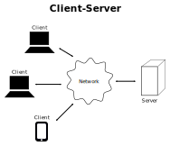
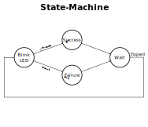
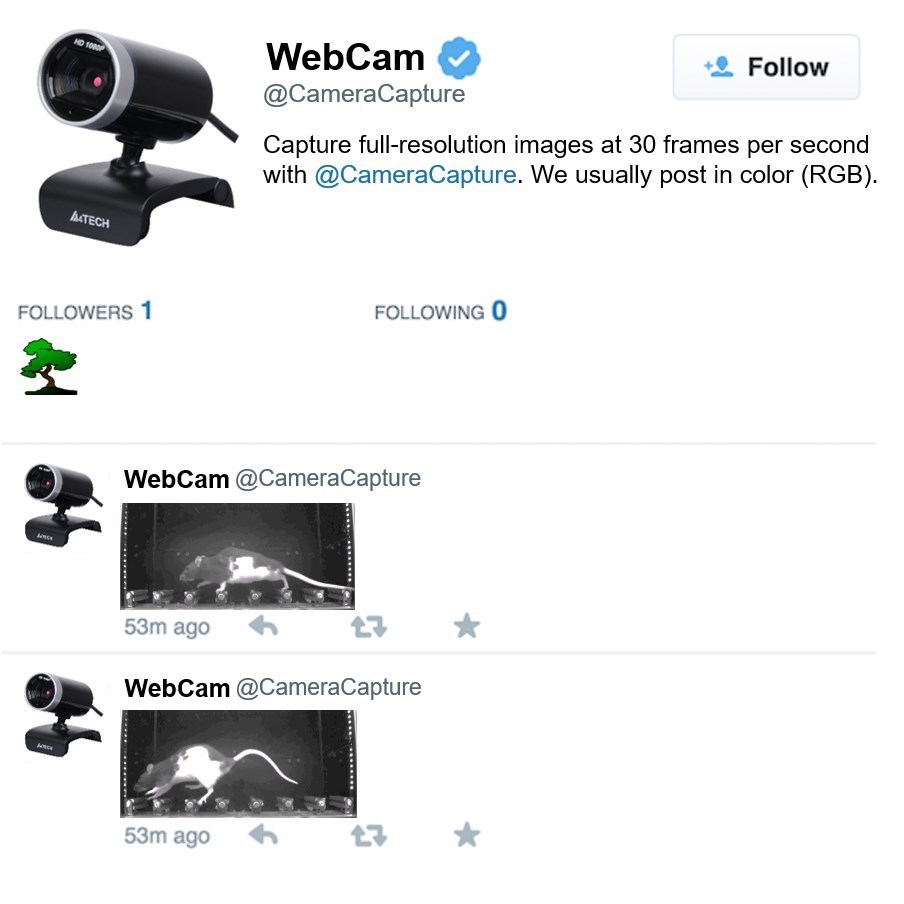
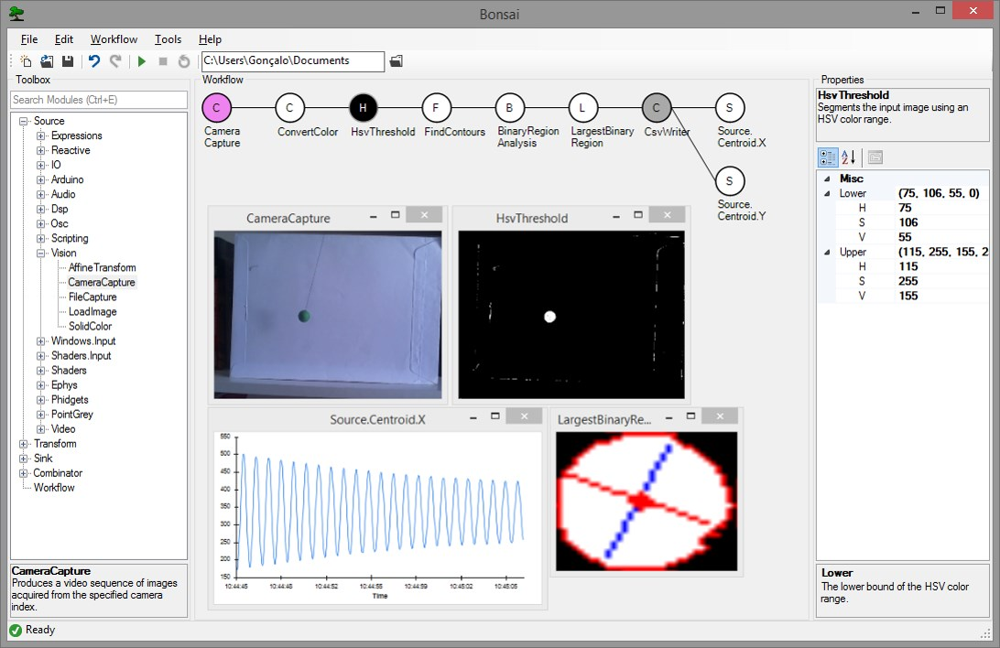
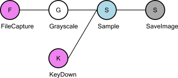
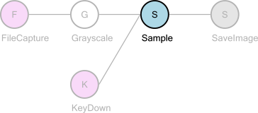

<section data-markdown data-separator="^\n---\n$" data-separator-vertical="^\n--\n$">

</section>

<!-- Raw HTML for embedded iframe backgrounds -->
<section data-background="#000000">
    <section data-markdown data-separator="^\n---\n$" data-separator-vertical="^\n--\n$">
    
    </section>
    <section data-background-iframe="https://www.youtube.com/embed/qXqAXgXJPmo?controls=0&amp;enablejsapi=1&amp;autoplay=1&amp;showinfo=0&amp;rel=0&amp;html5=1">
      <table style="height: 20%; margin-top: 65%; margin-left: -78px;">
        <tr><th>Lorenza Calcaterra, Kampff Lab</th></tr>
      </table>
    </section>
    <section data-background-iframe="https://www.youtube.com/embed/xyiqhiAiaY0?controls=0&amp;enablejsapi=1&amp;autoplay=1&amp;loop=1&amp;playlist=xyiqhiAiaY0&amp;showinfo=0&amp;rel=0&amp;html5=1">
      <table style="height: 20%; margin-top: 65%; margin-left: -78px;">
        <tr><th>Joana Neto, Kampff Lab</th></tr>
      </table>
    </section>
    <section data-background-iframe="https://www.youtube.com/embed/mJDV07ptQFk?start=40&amp;controls=0&amp;enablejsapi=1&amp;autoplay=1&amp;showinfo=0&amp;rel=0&amp;html5=1">
      <table style="height: 20%; margin-top: 65%; margin-left: -78px;">
        <tr><th>George Dimitriadis, Kampff Lab</th></tr>
      </table>
    </section>
</section>

<section data-markdown data-separator="^\n---\n$" data-separator-vertical="^\n--\n$">

</section>